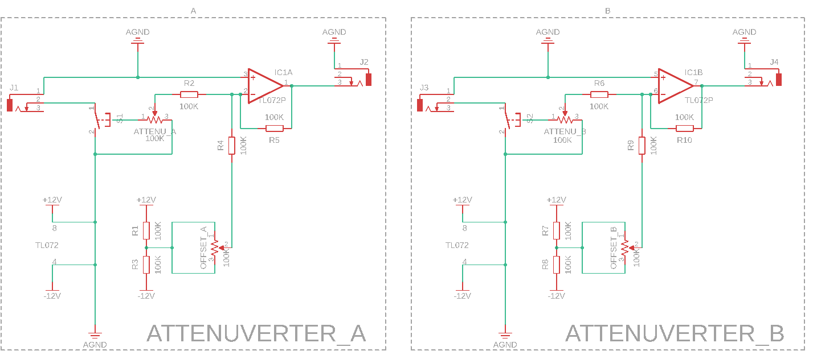

> Simple dual attenuverter using a TL072

Part list:
 - 10 100K Resistor
 - 1 TL072
 - 4 100K Pot
 - 2 SPST switch
 - 4 3.5 female jack

<a href="./assets/AttenuVerter.stl" dowload="panel.stl">Download Panel <a/>